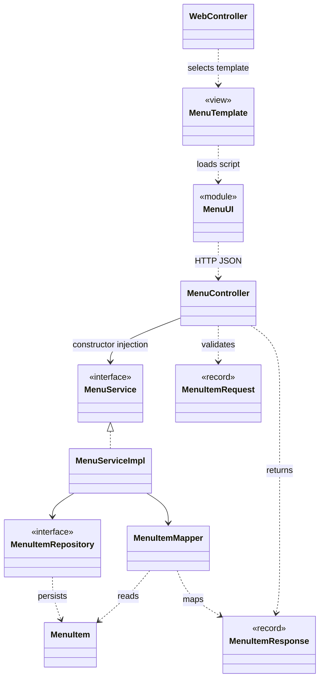
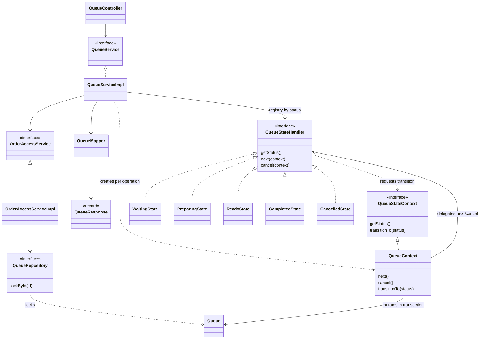
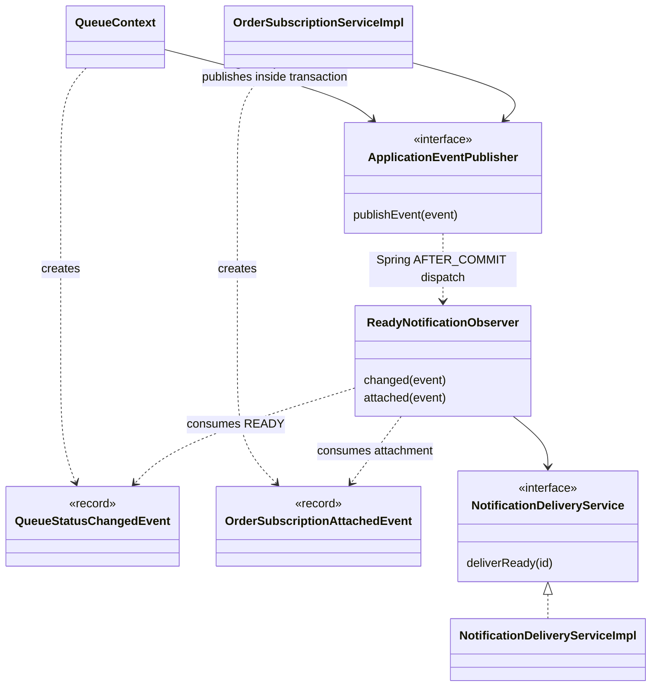
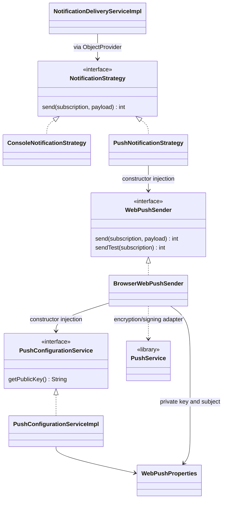

# Class and pattern diagrams

อ้างอิง `develop` baseline `87070b5` หลัง PR #79 วันที่ 10 ตุลาคม 2026 แผนภาพนี้เน้นคลาสที่เกี่ยวข้องกับ architectural patterns และ GoF Behavioral ทั้งสาม ใช้ประกอบ [Design Patterns](design-patterns.md) และ [SOLID analysis](solid-analysis.md) สำหรับรายละเอียด business entity ดู [ER](diagrams/er.md)

## Layers / MVC

MenuTemplate แทน `templates/menu.html`; MenuUI แทน `assets/menu-ui.js` ไม่ใช่คลาส Java เส้น browser → API แสดง HTTP call ไม่ใช่ constructor dependency โครงสร้างเดียวกันใช้กับออเดอร์ผ่าน OrderController/OrderService/OrderRepository/OrderMapper

## State

QueueStateContext เป็นชื่อแสดงใน diagram ของ nested interface `QueueStateHandler.Context` ไม่มีคลาส production ชื่อ QueueStateContext Context ถือ queue ที่ caller lock ไว้และสร้างใหม่ต่อ operation; handlers เป็น stateless Spring beans

## Observer

เส้น publisher → observer แทนการ dispatch ของ Spring ด้วย TransactionalEventListener ไม่ใช่ publisher เก็บ observer field เอง `fallbackExecution=false` ป้องกันการส่งนอก transaction; delivery recheck และ claim ป้องกันการส่ง READY ซ้ำ

## Strategy

ConditionalOnProperty เลือก concrete Strategy ตาม notification.mode; console คืน 0 และไม่เรียก sender ส่วน webpush เรียก WebPushSender โค้ด sender รับ PushConfigurationService ผ่าน interface หลังแก้ T-R18 แผนภาพละรายละเอียด DTO, validator, mapper และ transport test seam ที่ไม่จำเป็นต่อการอธิบาย pattern
