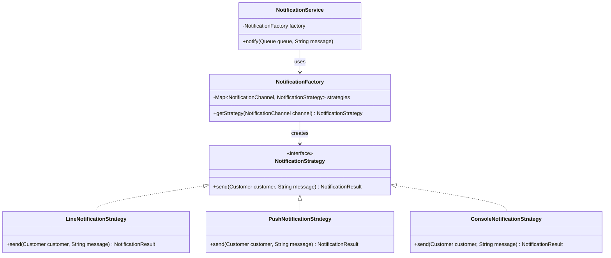
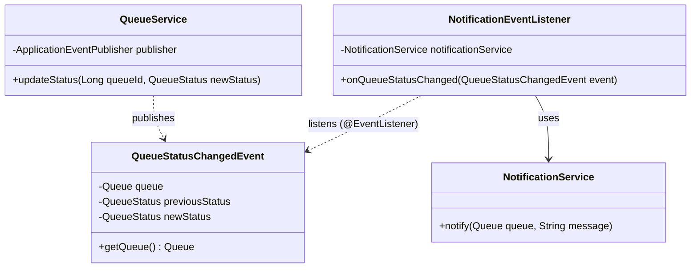
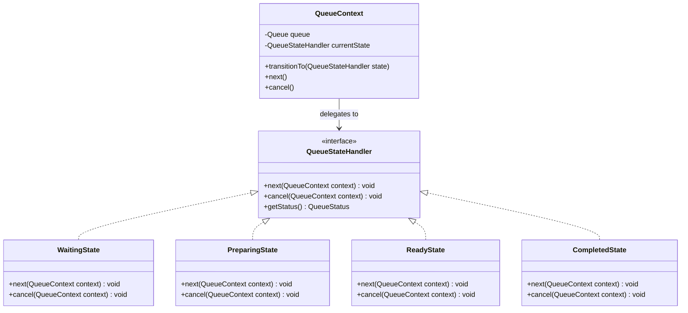

# Class Diagram — Design Patterns

## 1. Strategy Pattern — ช่องทางแจ้งเตือน

**ปัญหาที่แก้:** ถ้าไม่ใช้ Strategy จะต้องเขียน `if (channel == LINE) {...} else if (channel == PUSH) {...}` ใน `NotificationService` โดยตรง ทุกครั้งที่เพิ่มช่องทางใหม่ต้องแก้คลาสเดิม (ผิด OCP) — Strategy ทำให้เพิ่ม channel ใหม่ = เพิ่มคลาส implement `NotificationStrategy` เท่านั้น

## 2. Observer Pattern — แจ้งเตือนเมื่อสถานะคิวเปลี่ยน (ใช้ Spring ApplicationEvent)

**ปัญหาที่แก้:** `QueueService` ไม่จำเป็นต้องรู้จักหรือ inject `NotificationService` โดยตรง (decouple) — เมื่อสถานะเปลี่ยน แค่ publish event ใครก็ตามที่สนใจ (ตอนนี้คือ `NotificationEventListener` แต่ในอนาคตอาจมี `AnalyticsListener`, `KitchenDisplayListener`) มา subscribe เพิ่มได้โดยไม่แตะ `QueueService` เลย

## 3. State Pattern — วงจรสถานะของ Queue

**Transition ที่อนุญาต:** `WAITING → PREPARING → READY → COMPLETED` (เดินหน้าได้ทางเดียว) ยกเว้น `cancel()` ที่เรียกได้จาก `WAITING`/`PREPARING` เท่านั้น — `ReadyState.cancel()` และ `CompletedState.cancel()` ต้อง throw `IllegalStateTransitionException` แทนการ silent fail

**ปัญหาที่แก้:** ถ้าไม่ใช้ State จะต้องมี `if/switch` เช็คสถานะปัจจุบันทุกครั้งก่อนเปลี่ยนสถานะกระจายอยู่หลายจุดในโค้ด เสี่ยงต่อการเปลี่ยนสถานะผิดกฎ (เช่น COMPLETED ย้อนกลับไป WAITING) — State pattern รวม logic การเปลี่ยนสถานะไว้ในคลาสของสถานะนั้นเอง
