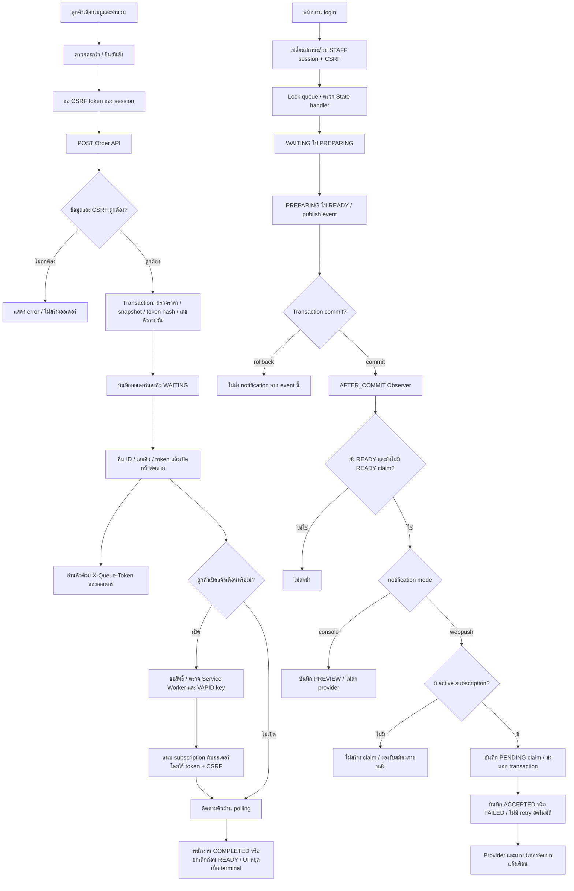

# Activity — Order to READY

อ้างอิง `develop` baseline `64b3ce7` วันที่ 10 ตุลาคม 2026

แผนภาพแสดงกิจกรรมลูกค้าและพนักงานที่เกิดแยกกัน การสมัครหลัง READY ใช้ attachment event แล้วเข้า delivery ตรวจใหม่ การยกเลิกทำได้เฉพาะ WAITING/PREPARING และต้องมี owner token หรือ STAFF พร้อม CSRF

ACCEPTED เป็นผลรับคำขอของ provider ไม่ใช่การยืนยัน popup โดยอุปกรณ์ ลูกค้ายังอ่านสถานะผ่าน polling ได้แม้ไม่ได้เปิด Push ดู [State](state.md) และ [READY sequence](sequence-ready.md)
