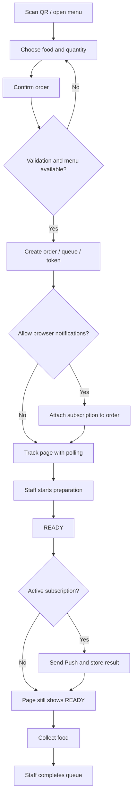

# activity

```mermaid
flowchart TD
 A[Scan QR / open menu] --> B[Choose food and quantity]
 B --> C[Confirm order]
 C --> D{Validation and menu available?}
 D -- No --> B
 D -- Yes --> E[Create order / queue / token]
 E --> F{Allow browser notifications?}
 F -- Yes --> G[Attach subscription to order]
 F -- No --> H[Track page with polling]
 G --> H
 H --> I[Staff starts preparation]
 I --> J[READY]
 J --> K{Active subscription?}
 K -- Yes --> L[Send Push and store result]
 K -- No --> M[Page still shows READY]
 L --> M
 M --> N[Collect food]
 N --> O[Staff completes queue]

```
