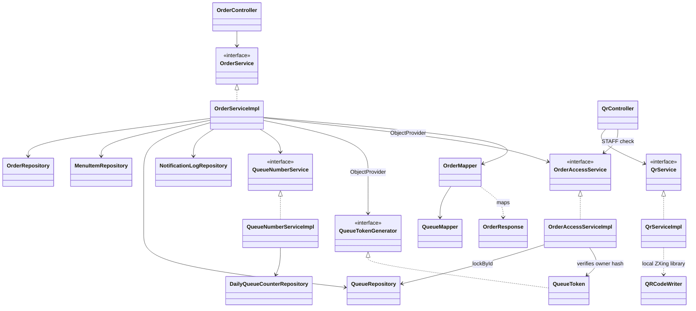

# Class overview

อ้างอิง `develop` baseline `64b3ce7` วันที่ 10 ตุลาคม 2026 แผนภาพนี้แสดง dependency ส่วนออเดอร์และ QR ที่มี implementation แล้ว ดูรายละเอียดเมนู, State, Observer และ Strategy ใน [Class and pattern diagrams](../class-diagram-patterns.md)

ลูกค้าอ่าน/แก้ออเดอร์ด้วย token เฉพาะออเดอร์ หรือใช้ STAFF session การแก้ออเดอร์ทำได้เฉพาะ WAITING ส่วน QR ใช้ STAFF และ URL HTTPS ของหน้าเมนูราก โดยสร้าง PNG ในแอป ไม่มีการเรียกบริการ QR ภายนอก

ดู [Domain](domain.md), [ER](er.md), [SOLID](../solid-analysis.md) และ [Patterns](../design-patterns.md)
