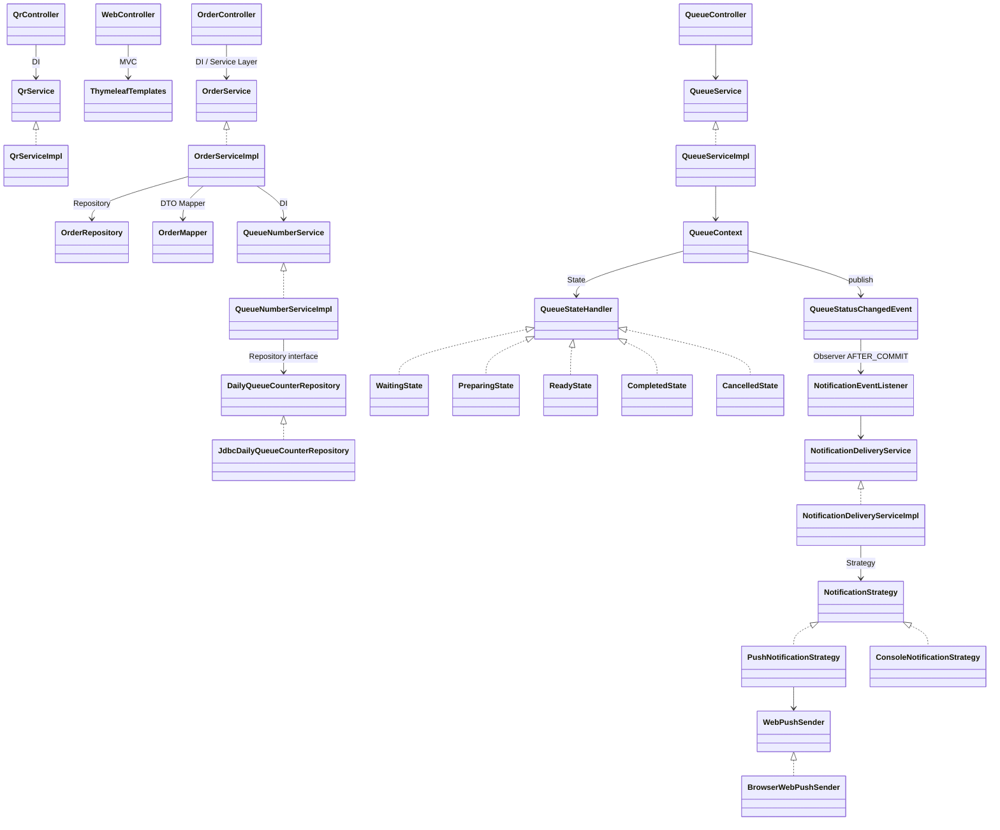

# class

```mermaid
classDiagram
 QrController --> QrService : DI
 QrService <|.. QrServiceImpl
 WebController --> ThymeleafTemplates : MVC
 OrderController --> OrderService : DI / Service Layer
 OrderService <|.. OrderServiceImpl
 OrderServiceImpl --> OrderRepository : Repository
 OrderServiceImpl --> OrderMapper : DTO Mapper
 OrderServiceImpl --> QueueNumberService : DI
 QueueNumberService <|.. QueueNumberServiceImpl
 QueueNumberServiceImpl --> DailyQueueCounterRepository : Repository interface
 DailyQueueCounterRepository <|.. JdbcDailyQueueCounterRepository
 QueueController --> QueueService
 QueueService <|.. QueueServiceImpl
 QueueServiceImpl --> QueueContext
 QueueContext --> QueueStateHandler : State
 QueueStateHandler <|.. WaitingState
 QueueStateHandler <|.. PreparingState
 QueueStateHandler <|.. ReadyState
 QueueStateHandler <|.. CompletedState
 QueueStateHandler <|.. CancelledState
 QueueContext --> QueueStatusChangedEvent : publish
 QueueStatusChangedEvent --> NotificationEventListener : Observer AFTER_COMMIT
 NotificationEventListener --> NotificationDeliveryService
 NotificationDeliveryService <|.. NotificationDeliveryServiceImpl
 NotificationDeliveryServiceImpl --> NotificationStrategy : Strategy
 NotificationStrategy <|.. PushNotificationStrategy
 NotificationStrategy <|.. ConsoleNotificationStrategy
 PushNotificationStrategy --> WebPushSender
 WebPushSender <|.. BrowserWebPushSender

```
