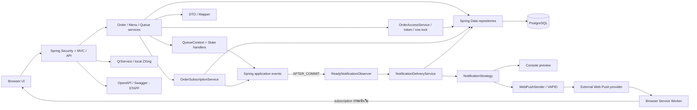

# Component overview

อ้างอิง `develop` baseline `64b3ce7` วันที่ 10 ตุลาคม 2026 State/Security และ Subscription/Push/Log รวมแล้ว

เส้น provider → Service Worker เป็นการส่ง Push ผ่านบริการเบราว์เซอร์ ไม่ใช่การตอบกลับ HTTP ของ API หน้าเว็บ Service Worker ขอแสดงแจ้งเตือนกับระบบปฏิบัติการ ภาพนี้ไม่ยืนยันว่ามี deployment ภายนอกแล้ว

QueueContext สร้าง transition event ภายใน transaction และ Observer เรียก delivery หลัง commit การส่ง HTTP ไป provider อยู่นอก transaction/row lock และผลบันทึกใน notification_log ดู [READY sequence](sequence-ready.md) และ [Deployment](deployment.md)
