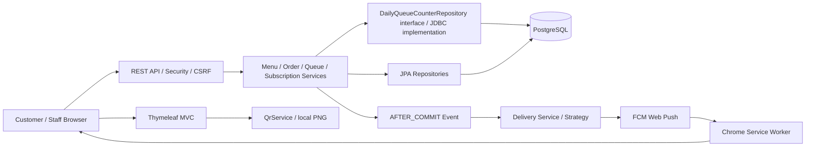

# component

```mermaid
flowchart LR
 Browser[Customer / Staff Browser] --> MVC[Thymeleaf MVC]
 Browser --> API[REST API / Security / CSRF]
 API --> Services[Menu / Order / Queue / Subscription Services]
 MVC --> QR[QrService / local PNG]
 Services --> Repo[JPA Repositories]
 Services --> Counter[DailyQueueCounterRepository interface / JDBC implementation]
 Counter --> DB
 Repo --> DB[(PostgreSQL)]
 Services --> Event[AFTER_COMMIT Event]
 Event --> Delivery[Delivery Service / Strategy]
 Delivery --> Provider[FCM Web Push]
 Provider --> SW[Chrome Service Worker]
 SW --> Browser

```
