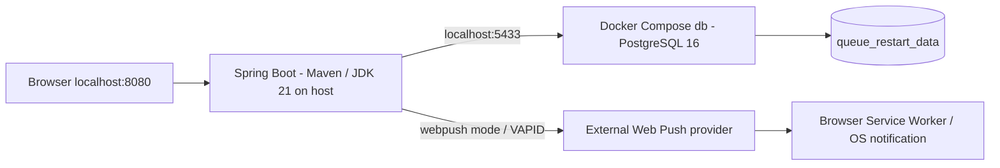
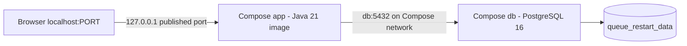
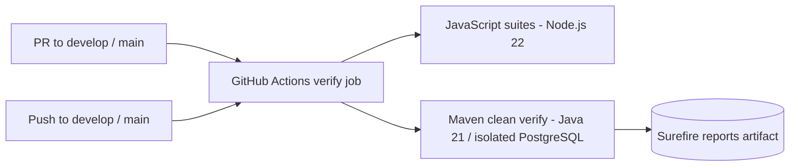
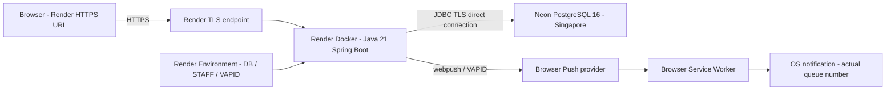

# Deployment / runtime

อ้างอิง deployment ของ `develop` revision `c07292e` หลัง PR #81 วันที่ 10 ตุลาคม 2026 ตั้งค่า Neon/Render แล้ว และผู้ใช้ยืนยันการสร้างออเดอร์กับรับ Web Push เลขคิวจริงถูกต้องบน URL ด้านล่าง

## Local runtime ที่ใช้ทดสอบ

การทดสอบในเครื่องใช้ Maven รันแอปและ Compose รัน db โดยส่ง STAFF/VAPID/NOTIFICATION_MODE ผ่าน environment ของ Git Bash provider/Service Worker แสดงเส้นทาง Push ซึ่งต้องตั้งค่าและสมัครจริง ไม่ได้ยืนยัน popup ทุกอุปกรณ์ ดู [README](../../README.md)

## Compose app ที่มี configuration อยู่

Compose app รับ DB/PORT แต่ยังไม่ส่ง STAFF/VAPID/mode/profile ให้ container จึงต้องปรับก่อนใช้ทดสอบ STAFF/Web Push แบบครบ ระบบเก็บข้อมูลใน named volume; down เก็บ volume ไว้ Docker image build ข้าม tests

## CI ที่กำหนดไว้

Workflow อยู่ใน [.github/workflows/ci-cd.yml](../../.github/workflows/ci-cd.yml) ภาพนี้แสดง configuration ไม่ได้อ้างว่า CI run ล่าสุดผ่านโดยไม่มีผล run ให้ตรวจ workflow run ของ revision ที่ส่งมอบด้วย GitHub Actions ยังไม่มี publish/deploy job; Render เป็นบริการ deploy แยกกัน และสถานะ Auto-Deploy ของ service ไม่ได้ยืนยันจากหลักฐานรอบนี้

## Cloud runtime ที่ทดสอบแล้ว

URL: [food-queue-notifier-1.onrender.com](https://food-queue-notifier-1.onrender.com/)

Render Web Service ใช้ Free plan, Singapore, Git branch `develop`, Dockerfile ที่ราก repo และ Root Directory ว่าง แอปรับ PORT จาก Render; log ที่ตรวจแสดง 10000 หน้าเว็บรับ HTTPS จาก Render endpoint

Neon ใช้ Free plan, Singapore, PostgreSQL 16, branch `production` และ database `neondb` ชื่อ branch ฐานข้อมูลไม่ได้หมายความว่า Git revision เป็น final release Direct connection เปิด TLS และ Flyway ใช้ datasource เดียวกับแอป V1–V6 บนฐานใหม่ผ่านแล้ว

DB credentials, STAFF password และ VAPID key pair ตั้งใน Environment ของ Render ไม่รวม secrets ลง diagram หรือ repository การทดสอบด้วย Maven ในเครื่องที่ชี้ฐาน Neon เดียวกันใช้ข้อมูลร่วมกับ Render ไม่ใช่ข้อมูลใน Docker เดิม

ผู้ใช้ยืนยันสร้างออเดอร์และรับแจ้งเตือนเลขคิวจริงบน URL นี้แล้ว หลักฐานเป็นผลรอบที่ทดสอบ ไม่รับรองทุกอุปกรณ์หรือแปลผล provider ACCEPTED ว่า popup แสดงเสมอ ดู [Deployment test report](../deployment-test-report.md)

## การส่งมอบที่ยังเหลือ

Render Free อาจพักเมื่อไม่ได้ใช้งาน จึงเปิดเว็บล่วงหน้าก่อนสาธิต เก็บภาพ acceptance และข้อมูลอุปกรณ์/เบราว์เซอร์โดยปิดบัง credentials และ owner tokens

หลังตรวจเอกสาร/สไลด์และ final acceptance ให้ merge `develop` → `main` ผ่าน PR แล้วเปลี่ยน Render branch เป็น `main` และ deploy revision นั้น ตรวจผลและบันทึก SHA ใหม่ก่อนส่งมอบ การเปลี่ยน Git branch ไม่ได้ย้ายหรือลบฐานข้อมูล Neon
