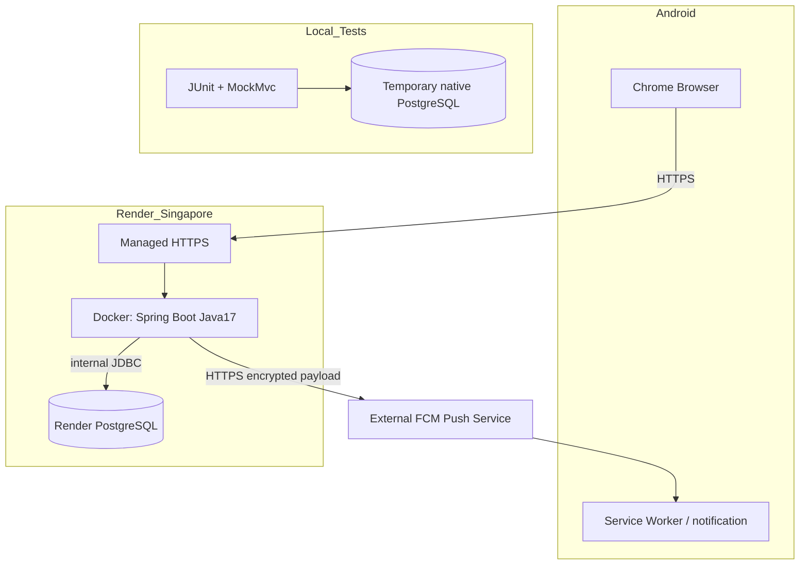

# deployment

```mermaid
flowchart TB
 subgraph Android
  Chrome[Chrome Browser]
  SW[Service Worker / notification]
 end
 subgraph Render_Singapore
  TLS[Managed HTTPS]
  App[Docker: Spring Boot Java17]
  DB[(Render PostgreSQL)]
  TLS --> App
  App -->|internal JDBC| DB
 end
 Chrome -->|HTTPS| TLS
 App -->|HTTPS encrypted payload| FCM[External FCM Push Service]
 FCM --> SW
 subgraph Local_Tests
  Tests[JUnit + MockMvc]
  TempDB[(Temporary native PostgreSQL)]
  Tests --> TempDB
 end

```
