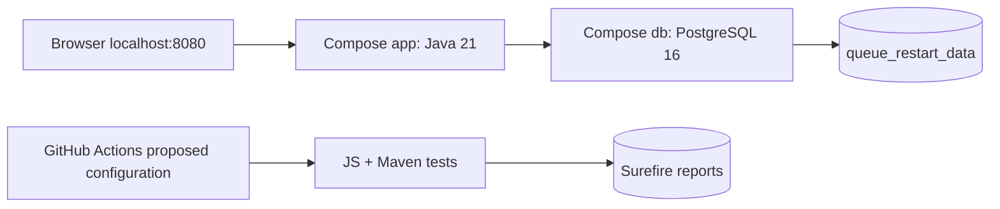

# Deployment

```mermaid
flowchart LR
  L[Browser localhost:8080] --> A[Compose app: Java 21]
  A --> D[Compose db: PostgreSQL 16]
  D --> V[(queue_restart_data)]
  CI[GitHub Actions proposed configuration] --> J[JS + Maven tests]
  J --> E[(Surefire reports)]
```

เส้นที่ระบุรอ C/T เป็นงานที่ยังไม่รวมในระบบ; deployment เป็น configuration ที่ต้องตรวจรันจริง
