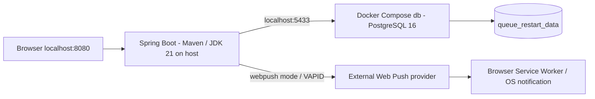
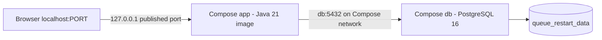
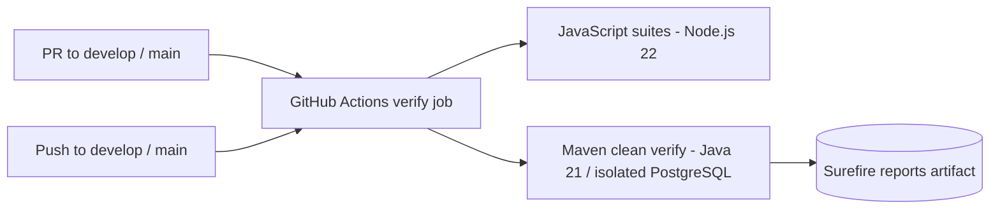

# Deployment / runtime

อ้างอิง `develop` baseline `64b3ce7` วันที่ 10 ตุลาคม 2026 ยังไม่ได้เลือกและตั้งค่า cloud database/deployment และไม่มี deployment URL ที่ยืนยันแล้ว

## Local runtime ที่ใช้ทดสอบ

การทดสอบในเครื่องใช้ Maven รันแอปและ Compose รัน db โดยส่ง STAFF/VAPID/NOTIFICATION_MODE ผ่าน environment ของ Git Bash provider/Service Worker แสดงเส้นทาง Push ซึ่งต้องตั้งค่าและสมัครจริง ไม่ได้ยืนยัน popup ทุกอุปกรณ์ ดู [README](../../README.md)

## Compose app ที่มี configuration อยู่

Compose app รับ DB/PORT แต่ยังไม่ส่ง STAFF/VAPID/mode/profile ให้ container จึงต้องปรับก่อนใช้ทดสอบ STAFF/Web Push แบบครบ ระบบเก็บข้อมูลใน named volume; down เก็บ volume ไว้ Docker image build ข้าม tests

## CI ที่กำหนดไว้

Workflow อยู่ใน [.github/workflows/ci-cd.yml](../../.github/workflows/ci-cd.yml) ภาพนี้แสดง configuration ไม่ได้อ้างว่า CI run ล่าสุดผ่านโดยไม่มีผล run ให้ตรวจ workflow run ของ revision ที่ส่งมอบด้วย CI ยังไม่มี publish/deploy อัตโนมัติ

## สิ่งที่ต้องกำหนดก่อน cloud deployment

เลือก web hosting และ managed PostgreSQL, ตั้ง HTTPS/domain และ database connection, เก็บ STAFF/VAPID credentials ใน environment ของผู้ให้บริการ และตรวจ migration/acceptance บนปลายทางจริง หากเปลี่ยน origin ต้องขอ permission และสมัคร subscription สำหรับ origin ใหม่

เมื่อเลือกผู้ให้บริการและตรวจ deployment แล้ว จึงเพิ่มชื่อบริการ/URL และผล acceptance ลง diagram นี้ ไม่ใช้แผน cloud ที่เสนอเป็นหลักฐานว่า deploy สำเร็จ
