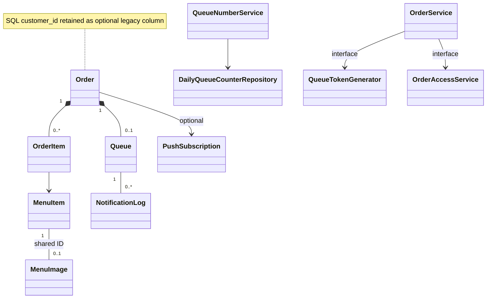

# Domain model

MenuImage entity map ไป menu_item_image; order item เก็บ snapshot อิสระจากราคาที่เปลี่ยนใน MenuItem Order/Queue map shared ID ด้วย MapsId ไม่เติม State, security หรือ Push implementation จากแบบจำลองนี้
