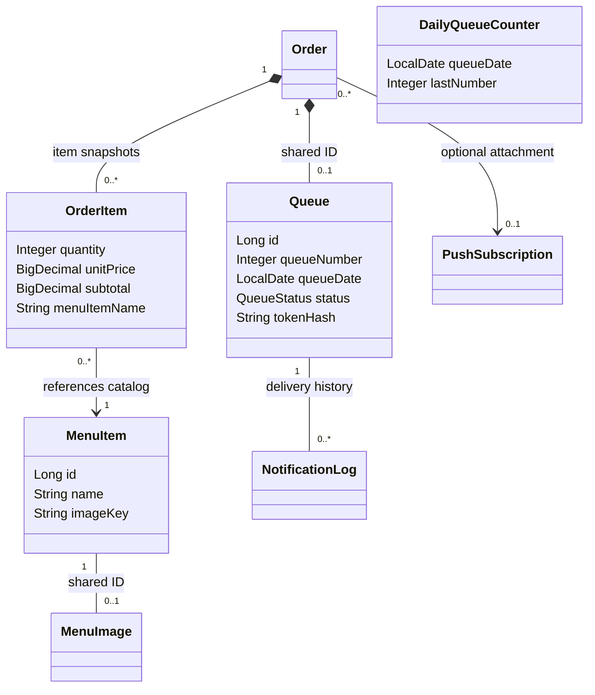

# Domain model

อ้างอิง `develop` baseline `64b3ce7` วันที่ 10 ตุลาคม 2026 แสดง object relationships ปัจจุบัน โดย legacy SQL columns แยกอธิบายด้านล่าง

MenuImage map ไป menu_item_image ส่วน MenuItem.imageKey แทน built-in asset หรือ key ของรูปอัปโหลด OrderItem เก็บชื่อและราคาขณะสั่งโดยไม่เปลี่ยนตาม catalog ภายหลัง Order/Queue ใช้ shared primary key ผ่าน MapsId

DailyQueueCounter มี primary key เป็นวันที่ Bangkok ใช้จัดเลขคิวรายวันโดยไม่ผูก FK กับ Queue โดยตรง Customer/NotificationPreference และ orders.customer_id/status ยังอยู่ใน SQL เพื่อเก็บข้อมูล legacy แต่ Order entity ปัจจุบันไม่ใช้ customer association/status ดังกล่าว สถานะที่ใช้งานอยู่ใน Queue

State, Observer และ Strategy เป็นพฤติกรรมใน services ไม่ใช่ความสัมพันธ์ entity ใน diagram นี้ ดู [Class and pattern diagrams](../class-diagram-patterns.md), [State](state.md) และ [ER](er.md)
