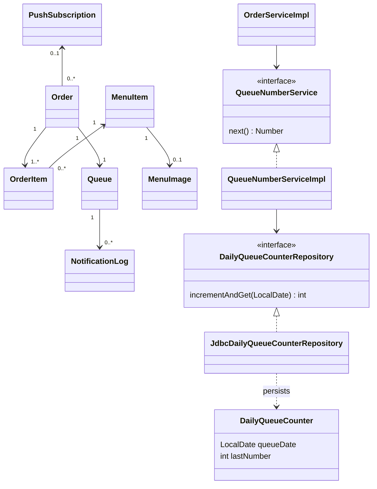

# domain

DailyQueueCounter is a technical table keyed by the Bangkok date; it has no FK to Queue.
Customer and NotificationPreference remain as legacy entities. Existing orders retain the
database customer_id/status fields, while the anonymous Order entity does not expose them.
