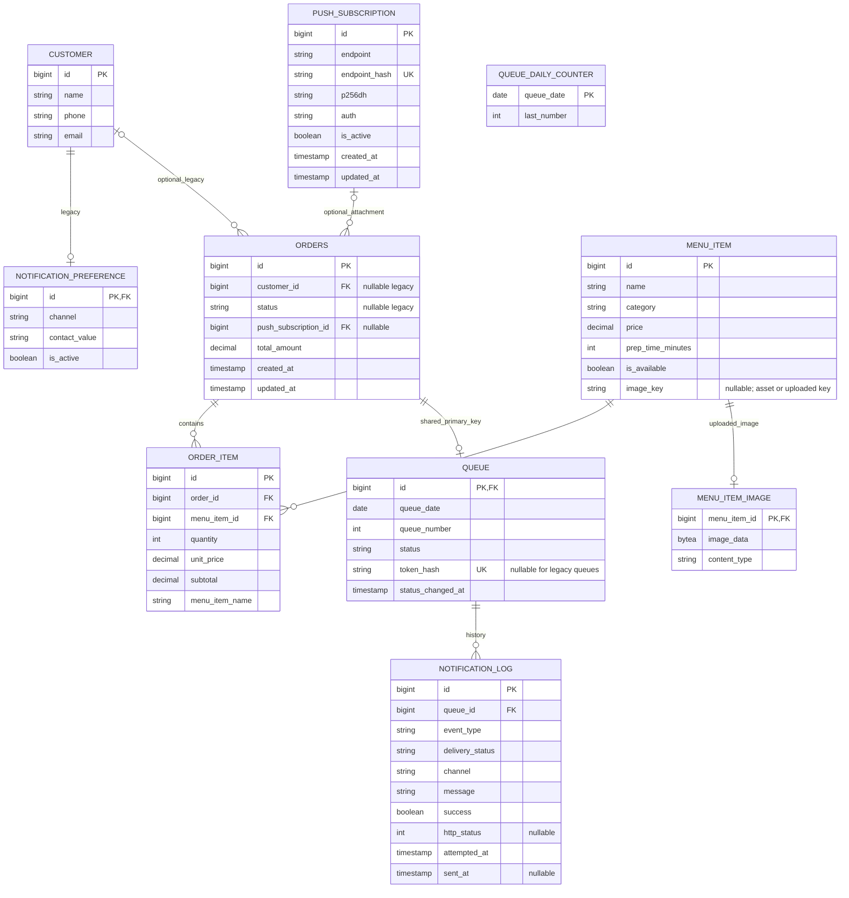

# ER diagram — V1–V6

อ้างอิง SQL migrations ใน `develop` baseline `64b3ce7` วันที่ 10 ตุลาคม 2026 แสดงทั้งตารางที่ใช้ปัจจุบันและตาราง legacy โดยเลือกคอลัมน์สำคัญมาประกอบความสัมพันธ์

ชื่อ uppercase ใน diagram เป็น logical name; SQL จริงใช้ lowercase เช่น orders และ menu_item_image

- Queue unique(queue_date,queue_number) และ token_hash unique; counter ไม่ผูก FK กับคิว
- OrderItem unique(order_id,menu_item_id) และเก็บ price/name snapshot
- READY log unique แบบ partial index บน (queue_id,event_type) เฉพาะ event_type='READY' เพื่อ durable claim ป้องกันส่งซ้ำ
- Subscription หนึ่งรายการผูกหลายออเดอร์ได้; การ detach ถอด association ของออเดอร์นั้น
- V6 เติมค่า menu_item.image_key เท่านั้น ไม่เพิ่มตาราง/คอลัมน์ และไม่เขียนทับ uploaded image
- Customer/NotificationPreference และ orders.customer_id/status เป็น legacy; flow ลูกค้าใหม่ไม่ต้องสมัครบัญชีและสถานะปัจจุบันอยู่ใน Queue

Subscription/Log มี implementation ใช้งานแล้ว ดู [Migration](../migration.md), [Domain](domain.md), [Push delivery](../push-delivery.md) และ SQL จริงใน code/src/main/resources/db/migration สำหรับรายละเอียด constraints ทั้งหมด
