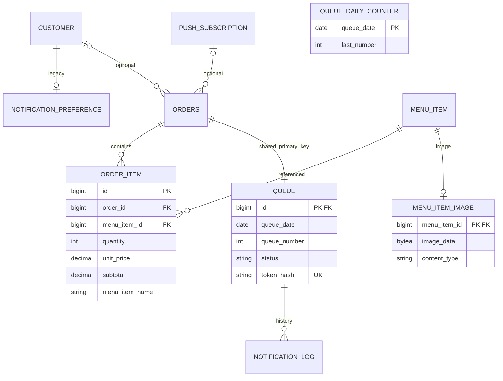

# ER diagram (V1–V5)

ชื่อ uppercase เป็นชื่อ logical ของ table SQL จริงใช้ lowercase `menu_item_image` Queue unique(queue_date,queue_number); counter ไม่ผูก FK กับคิว READY log unique แบบ partial index Subscription/Log เป็น data model รอ T implementation
