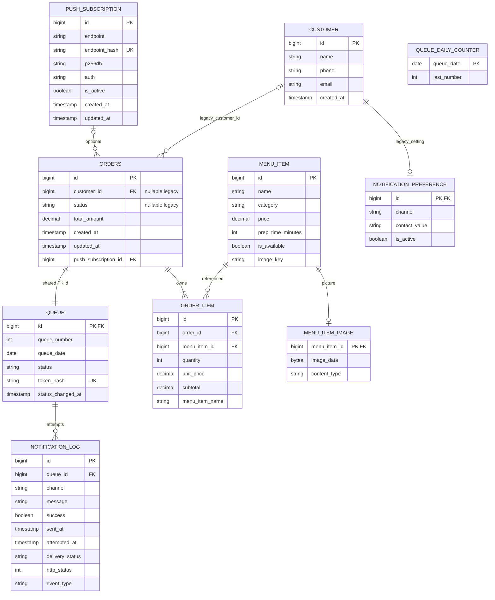

# ER — TEAM-HANDOFF V1–V5

`QUEUE` ใช้ UNIQUE(queue_date, queue_number) ร่วมกัน ไม่ใช่ queue_number เพียงตัวเดียว. ตารางเทคนิค `QUEUE_DAILY_COUNTER` เก็บ queue_date DATE PK และ last_number INT ต่อวัน ไม่ใช่ FK ของคิว; ภายใน transaction ใช้ row lock เพื่อออกเลขพร้อมกันโดยไม่ซ้ำ.

รวม 10 ตารางแอป: 6 หลัก + 2 legacy + ภาพเมนู + counter; ไม่นับ Flyway history.
ORDER_ITEM มี UNIQUE(order_id,menu_item_id); NOTIFICATION_LOG มี partial UNIQUE(queue_id,event_type) เฉพาะ READY.
Customer/status เก่ายังคงใน DB แม้ anonymous Order ไม่ map relation นี้. queue.status เป็น operational state.
