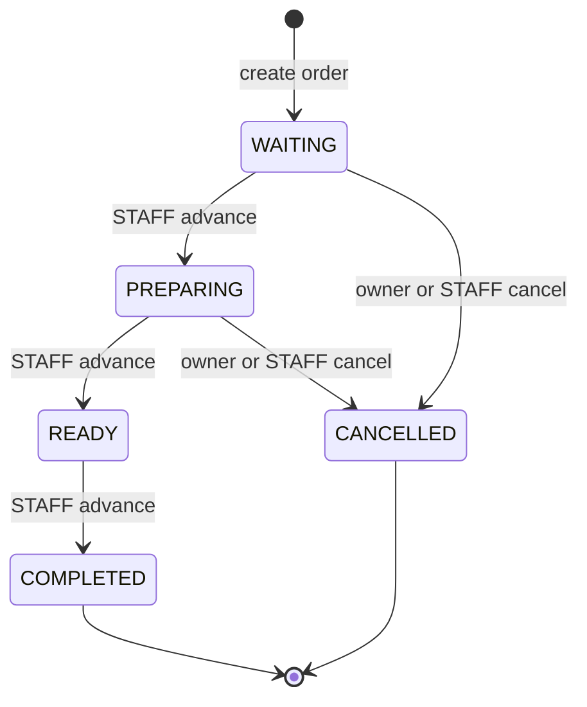

# Queue state diagram

เอกสารอ้างอิงโค้ดหลัง C15 ที่ shared baseline `431e824` (PR #70)
C16 เปลี่ยนเอกสารเท่านั้น ไม่เพิ่มกฎธุรกิจใหม่

`[*]` หลัง COMPLETED/CANCELLED แสดงจุดจบของ lifecycle ไม่ใช่การลบข้อมูล
ไม่มีเส้นย้อนกลับ ไม่มีการ cancel จาก READY และไม่มี advance/cancel หลังสถานะสิ้นสุด
คำขอที่ละเมิดกฎตอบ 409 โดยไม่เปลี่ยนสถานะหรือ timestamp

| สถานะปัจจุบัน | advance (STAFF) | cancel (owner/STAFF) | แก้รายการ (owner/STAFF) | ลบบิล (STAFF) |
|---|---|---|---|---|
| WAITING | PREPARING | CANCELLED | ได้ | ได้เมื่อไม่มี notification log |
| PREPARING | READY | CANCELLED | 409 | 409 |
| READY | COMPLETED | 409 | 409 | 409 |
| COMPLETED | 409 | 409 | 409 | 409 |
| CANCELLED | 409 | 409 | 409 | 409 |

ตารางนี้แสดงกฎหลังผ่านการตรวจสิทธิ์และ CSRF แล้ว คำขอที่ไม่มีสิทธิ์อาจถูกปฏิเสธก่อนถึงกฎสถานะ
การสร้างบิลกำหนด WAITING ใน `OrderServiceImpl.create` และบันทึก token hash ของบิลนั้น

## จุดที่ใช้ State pattern

- `QueueStateHandler` กำหนด `next`, `cancel`, `getStatus` และ Context contract
- `WaitingState`, `PreparingState`, `ReadyState`, `CompletedState`, `CancelledState` เป็น handler ที่ไม่มี mutable state ของบิล
- `QueueServiceImpl` รับ handlers ผ่าน constructor แล้วตรวจว่าครบทุก QueueStatus อย่างละหนึ่งตัว
- `QueueContext` สร้างใหม่แต่ละ operation ตรวจว่ามี writable transaction และ handler ตรงกับสถานะจริง ก่อนแก้สถานะและเผยแพร่ event
- `QueueStatusChangedEvent` เก็บสถานะก่อน/หลังและเวลาเปลี่ยนแปลง ส่วน observer ของ Push รับหลัง commit

ไฟล์ทั้งหมดอยู่ใต้ `code/src/main/java/com/kku/queuenotify/service/` และ `service/impl/`
รายละเอียด transaction และสิทธิ์อยู่ใน [security-and-state.md](../security-and-state.md)

## คำขอที่เข้าพร้อมกัน

บริการตรวจสถานะหลังได้ pessimistic row lock ของ queue และถือ lock จน transaction จบ
ถ้า cancel commit ก่อน advance ที่รออยู่ คำขอ advance ต้องพบ CANCELLED และตอบ 409
ถ้า PREPARING → READY commit ก่อน cancel ที่รออยู่ คำขอ cancel ต้องตอบ 409
ถ้า READY → COMPLETED commit ก่อน advance ที่รออยู่ คำขอ advance ต้องตอบ 409

คำขอ advance สองคำขอจาก WAITING อาจสำเร็จทั้งคู่เป็น PREPARING แล้ว READY ตามลำดับ
API ปัจจุบันไม่มี expected-state หรือ idempotency key จึงไม่ได้รับประกันว่าคำขอซ้ำจะนับเป็นขั้นเดียว
ผลทดสอบการแข่งขันนี้อยู่ใน [state-test-report.md](../state-test-report.md)
