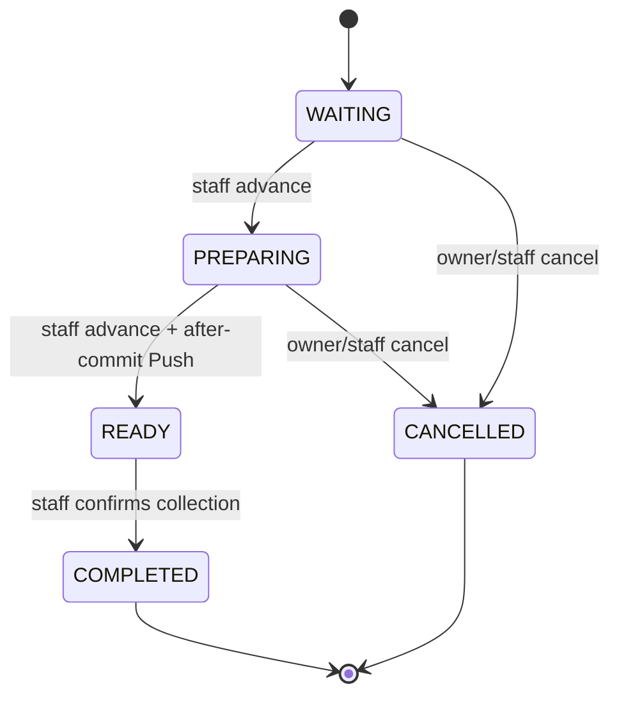

# state

```mermaid
stateDiagram-v2
 [*] --> WAITING
 WAITING --> PREPARING: staff advance
 PREPARING --> READY: staff advance + after-commit Push
 READY --> COMPLETED: staff confirms collection
 WAITING --> CANCELLED: owner/staff cancel
 PREPARING --> CANCELLED: owner/staff cancel
 COMPLETED --> [*]
 CANCELLED --> [*]

```
