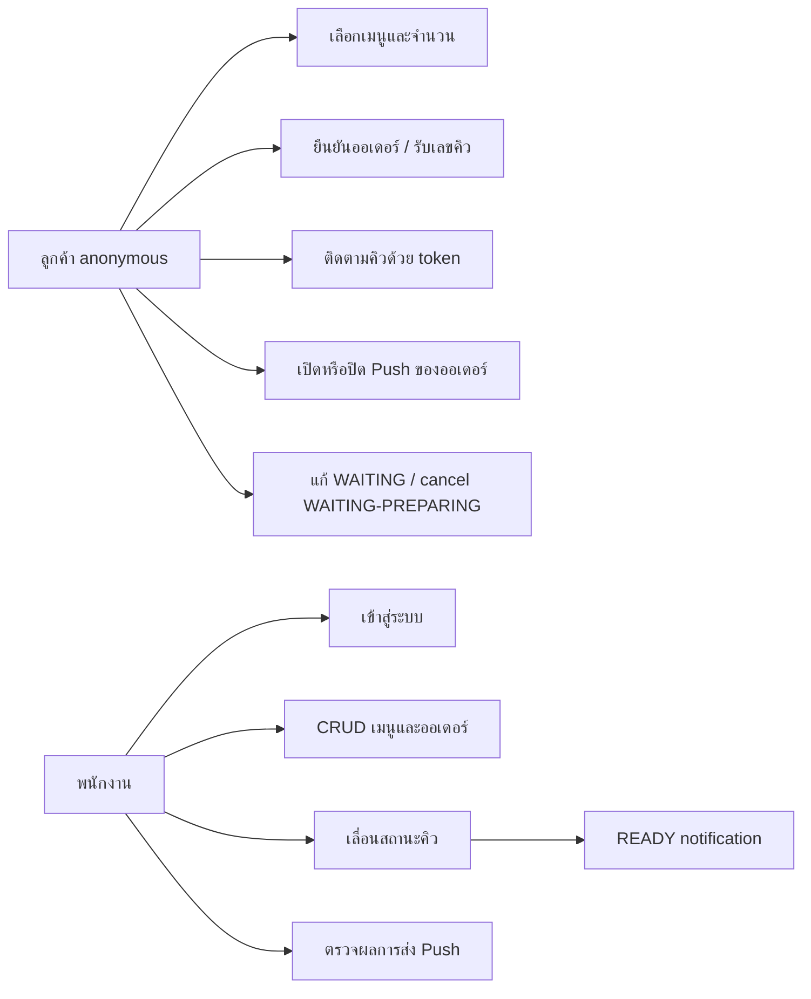

# use-case

```mermaid
flowchart LR
 Customer[ลูกค้า anonymous] --> Menu[เลือกเมนูและจำนวน]
 Customer --> Place[ยืนยันออเดอร์ / รับเลขคิว]
 Customer --> Track[ติดตามคิวด้วย token]
 Customer --> Subscribe[เปิดหรือปิด Push ของออเดอร์]
 Customer --> Edit[แก้ WAITING / cancel WAITING-PREPARING]
 Staff[พนักงาน] --> Login[เข้าสู่ระบบ]
 Staff --> Manage[CRUD เมนูและออเดอร์]
 Staff --> Advance[เลื่อนสถานะคิว]
 Staff --> Logs[ตรวจผลการส่ง Push]
 Advance --> Ready[READY notification]

```
