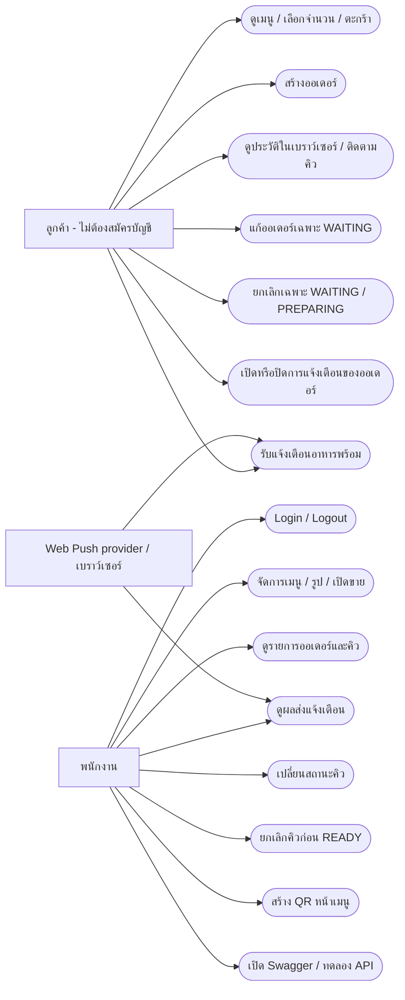

# Use-case overview

อ้างอิง `develop` baseline `64b3ce7` วันที่ 10 ตุลาคม 2026 ใช้ Mermaid flowchart แสดง actor/use case โดยประมาณ รายละเอียดเงื่อนไขอยู่ใน [Use-case descriptions](use-case-descriptions.md)

การดู/แก้/ยกเลิกออเดอร์และการแนบ subscription ของลูกค้าใช้ token เฉพาะออเดอร์ การ mutation ใช้ CSRF พนักงานใช้ STAFF session และ CSRF ส่วน provider → log หมายถึงผล HTTP ที่แอปบันทึกหลังส่ง ไม่ใช่ provider เขียนฐานข้อมูลโดยตรง

ประวัติลูกค้าอาศัย ID/token ที่เก็บในเบราว์เซอร์ ไม่ใช่บัญชีลูกค้าที่ค้นคืนจากเครื่องอื่นได้อัตโนมัติ ปิดการแจ้งเตือนของออเดอร์เป็นการถอด association ไม่ใช่ unsubscribe ทุกออเดอร์ของเบราว์เซอร์
