# ER Diagram — ระบบแจ้งเตือนคิวรับอาหาร/เครื่องดื่ม

```mermaid
erDiagram
    CUSTOMER ||--|| NOTIFICATION_PREFERENCE : "has (1:1)"
    CUSTOMER ||--o{ ORDERS : "places (1:N)"
    ORDERS ||--o{ ORDER_ITEM : "contains (1:N)"
    MENU_ITEM ||--o{ ORDER_ITEM : "referenced by (1:N)"
    ORDERS ||--|| QUEUE : "generates (1:1)"
    QUEUE ||--o{ NOTIFICATION_LOG : "produces (1:N)"

    CUSTOMER {
        bigint id PK
        varchar name
        varchar phone
        varchar email
        timestamp created_at
    }

    NOTIFICATION_PREFERENCE {
        bigint id PK
        bigint customer_id FK "UNIQUE - 1:1"
        varchar channel "LINE / PUSH / SMS / CONSOLE"
        varchar contact_value
        boolean is_active
    }

    MENU_ITEM {
        bigint id PK
        varchar name
        varchar category
        decimal price
        int prep_time_minutes
    }

    ORDERS {
        bigint id PK
        bigint customer_id FK
        varchar status "enum OrderStatus"
        decimal total_amount
        timestamp created_at
    }

    ORDER_ITEM {
        bigint id PK
        bigint order_id FK
        bigint menu_item_id FK
        int quantity
        decimal subtotal
    }

    QUEUE {
        bigint id PK
        bigint order_id FK "UNIQUE - 1:1"
        int queue_number
        varchar status "enum QueueStatus"
        timestamp status_changed_at
    }

    NOTIFICATION_LOG {
        bigint id PK
        bigint queue_id FK
        varchar channel
        varchar message
        boolean success
        timestamp sent_at
    }
```

## หมายเหตุการออกแบบ

| จุด | เหตุผล |
|---|---|
| `NOTIFICATION_PREFERENCE.customer_id` เป็น UNIQUE | บังคับความสัมพันธ์ 1:1 กับ CUSTOMER |
| `QUEUE.order_id` เป็น UNIQUE | หนึ่ง Order สร้างได้แค่หนึ่ง Queue เท่านั้น (1:1) |
| `ORDER_ITEM` เป็น junction ระหว่าง ORDERS และ MENU_ITEM | จริง ๆ คือ Many-to-Many ระหว่าง Order/MenuItem แต่แตกเป็น 1:N สองเส้นเพื่อเก็บ quantity/subtotal (แนวทางมาตรฐานของ Order Line) |
| Cascade | `Order → OrderItem` ใช้ `CascadeType.ALL` + `orphanRemoval=true` เพราะ OrderItem ไม่มีความหมายถ้าไม่มี Order เจ้าของ |
| Fetch Type | `Order.orderItems` และ `Queue.notificationLogs` ใช้ `FetchType.LAZY` เพื่อลด N+1 และ payload ที่ไม่จำเป็น ส่วน `Customer.notificationPreference` (1:1) ใช้ `FetchType.LAZY` เช่นกันแต่ผูก `@MapsId` เพื่อลด query เพิ่ม |
